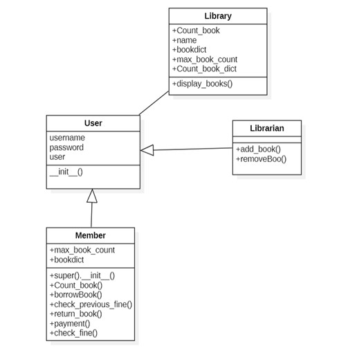

# **MINI E-LIBRARY MANAGEMENT SYSTEM**
<table>
<tr>
<td>

 Mini E-Library Management System is a Python library management system for dealing with book management. It aim to help the student and librarian to easily manage and track the books electronically. The highlight of this system is the convinience of borrowing and returning the book in their comfort at home.


</details>

</td>
</tr>
</table>

# **VIDEO PRESENTATION**
Watch out our [Video Presentation](https://youtu.be/pkXG9bfx8y4)!

```bash
 Mini E-Library Management System
```

.
# **Features**
### STUDENT
* Book Borrowing
* Book Returning
* Check Available Book in the library
* Fine Paying

### LIBRARIAN
* Book Adding
* Book Removing


.
# **UML (Unified Model Language)**




# **Instruction**
 
> Once the system run, Welcome page will be prompt and user will need to enter to continue. Menu of the system will be displayed, users can choose on the option provided. But to access the book adding and book removing, user will need to Register and Login their Librarian ID on the system as this is for Librarian access only.

.
# **Self Assesment**

| Metric                     |       Score        | Explanation                                                                |
|--------------------------  | ------------------ | ---------------------------------------------------------------------------|
| CODE REUSABILITY           | 4                  | We practice DRY by using Inheritance principle leading to a shorter and cleaner structure of our program compare as before
| MAINTABILITY               | 3                  | We can't say it's excellent as we are newbie and not that skilled with implementing much OOP principles but can say that are codes are readable and understandable aiding to its maintability                       |
| SCALABILITY                | 3                  | Program can handle immediate changes or update of feauture add-ons          |
| EXECUTION                  | 3                  | Program works completely as intended and declared. Errors are handled properly|
| ORIGINALITY                | 3                  | Concept is quite similar to some samples but confidently have a unique code logic |
| OVERALL IMPRESSION         | 4                  | The program runs smoothly without noticeable bugs or errors                 |


.
# **GROUPMATES PROFILE**
<h1 align="center">Hi 👋, I'm Nobaisah Kheram</h1>
<h3 align="center">A passionate IT student from BSIT-2101</h3>


<p align="left">  </p>

- 🔭 I’m currently working on [Mini-E Library Management System](https://github.com/nobaisahkheram/Finals-Mini-E-Library-Management-System.git)

- 🌱 I’m currently learning **Advanced Computer Programming**

<h3 align="left">Connect with me:</h3>
<p align="left">
<a href="https://twitter.com/@nsmpga_" target="blank"></a>
<a href="https://facebook.com/nobaysaganda" target="blank"></a>
<a href="https://instagram.com/@n.khrm_" target="blank"></a>
</p>

<h3 align="left">Languages and Tools:</h3>
<p align="left"> <a href="https://developer.mozilla.org/en-US/docs/Web/JavaScript" target="_blank" rel="noreferrer">  </a> <a href="https://www.python.org" target="_blank" rel="noreferrer">  </a> </p>

<p></p>

# .

<h1 align="center">Hi 👋, I'm Lyzel Leido</h1>
<h3 align="center">A passionate IT student from BSIT-2101</h3> 


<p align="left">  </p>

- 🔭 I’m currently working on [Mini-E Library Management System](https://github.com/nobaisahkheram/Finals-Mini-E-Library-Management-System.git)

- 🌱 I’m currently learning **Advanced Computer Programming**

<h3 align="left">Connect with me:</h3>
<p align="left">
<a href="https://twitter.com/@lydozzz" target="blank"></a>
<a href="https://facebook.com/profile.php?id=100014323146629&mibextid=zbwkwl" target="blank"></a>
<a href="https://instagram.com/@ly_dozzz" target="blank"></a>
</p>

<h3 align="left">Languages and Tools:</h3>
<p align="left"> <a href="https://developer.mozilla.org/en-US/docs/Web/JavaScript" target="_blank" rel="noreferrer">  </a> <a href="https://www.python.org" target="_blank" rel="noreferrer">  </a> </p>

<p></p>

# .

<h1 align="center">Hi 👋, I'm Jenny Almeniana</h1>
<h3 align="center">A passionate IT student from BSIT-2101</h3> 


<p align="left">  </p>

- 🔭 I’m currently working on [Mini-E Library Management System](https://github.com/nobaisahkheram/Finals-Mini-E-Library-Management-System.git)

- 🌱 I’m currently learning **Advanced Computer Programming**

<h3 align="left">Connect with me:</h3>
<p align="left">
<a href="https://facebook.com/profile.php?id=100014323146629&mibextid=zbwkwl" target="blank"></a>
<a href="https://instagram.com/@jnny_lmnn" target="blank"></a>
</p>

<h3 align="left">Languages and Tools:</h3>
<p align="left"> <a href="https://developer.mozilla.org/en-US/docs/Web/JavaScript" target="_blank" rel="noreferrer">  </a> <a href="https://www.python.org" target="_blank" rel="noreferrer">  </a> </p>

<p></p>

# .

<h1 align="center">Hi 👋, I'm Stephanie Andal</h1>
<h3 align="center">A passionate IT student from BSIT-2101</h3>


<p align="left">  </p>

- 🔭 I’m currently working on [Mini-E Library Management System](https://github.com/nobaisahkheram/Finals-Mini-E-Library-Management-System.git)

- 🌱 I’m currently learning **Advanced Computer Programming**

<h3 align="left">Connect with me:</h3>
<p align="left">
<a href="https://twitter.com/stephywephyyy" target="blank"></a>
<a href="https://facebook.com/einapets.andal?mibextid=zbwkwl" target="blank"></a>
<a href="https://instagram.com/@stephanieeinaandal" target="blank"></a>
</p>

<h3 align="left">Languages and Tools:</h3>
<p align="left"> <a href="https://developer.mozilla.org/en-US/docs/Web/JavaScript" target="_blank" rel="noreferrer">  </a> <a href="https://www.python.org" target="_blank" rel="noreferrer">  </a> </p>

<p></p>
